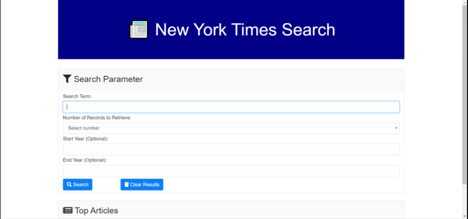
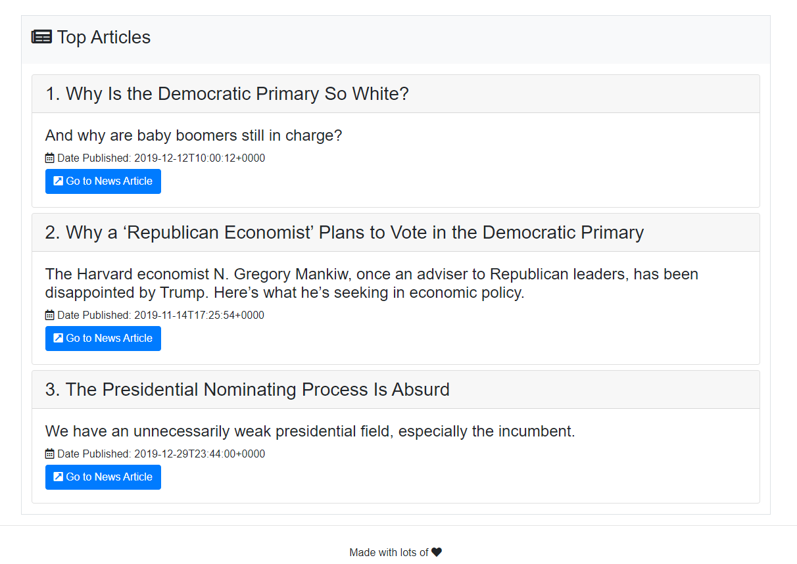

# NY Times

Easily search for NY Times articles.

## Getting Started

This application is compatible with the most commonly used web browsers.

## Site Pictures

1. Working Site



2. Returned articles




## Code Snippets


1. Search

```javascript

//Call to build query. Sends query to another function that return the articles according to the query. 
//Calls to render the articles
$("#search").on("click", function () {
    let numberOfRecords = $("#searchFilter [name=numberOfRecords]").val().trim();
    var queryURL = getQuery();
    getArticles(queryURL).then(function (articles) {
        renderArticles(articles, numberOfRecords);
    });
});
    
```
* This listerner takes care of th esteps necessary to go from getting the user's information to rendering the articles on the user's web. Calls a functon to build the query. Then with the query it calls a function that will get the articles from the NYT api. Once the articles are ready, they are sent to another function that renders the articles to the HTML.


2. Query building

```javascript

//Build query given the users parameters
function getQuery() {
    var queryURL = "https://api.nytimes.com/svc/search/v2/articlesearch.json?";
    let terms = $("#searchFilter [name=term]").val().trim();
    let startYear = $("#searchFilter [name=startYear]").val().trim();
    let endYear = $("#searchFilter [name=endYear]").val().trim();

    var queryParams = { "api-key": "3NYM77KW72ndmEaRDzr2cjaOcabhAIRW" };
    queryParams.q = terms;
    if (parseInt(startYear)) {
        queryParams.begin_date = startYear + "0101";
    }
    if (parseInt(endYear)) {
        queryParams.end_date = endYear + "0101";
    }

    return queryURL + $.param(queryParams);
}

```
* This function takes care of building the query. It gets the values from the fields that were filled form the user. These then add to an object of all the necesary parameters for the query. Then, the _queryParams_ object is added to the _queryURL_ with the _$.param()_ function.


## Built With

* [HTML](https://developer.mozilla.org/en-US/docs/Web/HTML)
* [CSS](https://developer.mozilla.org/en-US/docs/Web/CSS)
* [Bootstrap](https://getbootstrap.com/)
* [Javascript](https://www.javascript.com/)

## Deployed Link

* [See Live Site](https://kqarlos.github.io/ny-times)

## Author

 * **Carlos Toledo** 

## Links

- [Link to site repository](https://github.com/kqarlos/ny-times)
- [Link to Github](https://www.github.com/kqarlos)
- [Link to LinkedIn](https://www.linkedin.com/in/carlos-toledo415/)


## Acknowledgments

* [W3 Schools](https://www.w3schools.com/)
* [Bootstrap components](https://getbootstrap.com/docs/4.4/components/navbar/)
* [MDN Web Docs](https://developer.mozilla.org/en-US/docs/Web/API/Document_Object_Model)